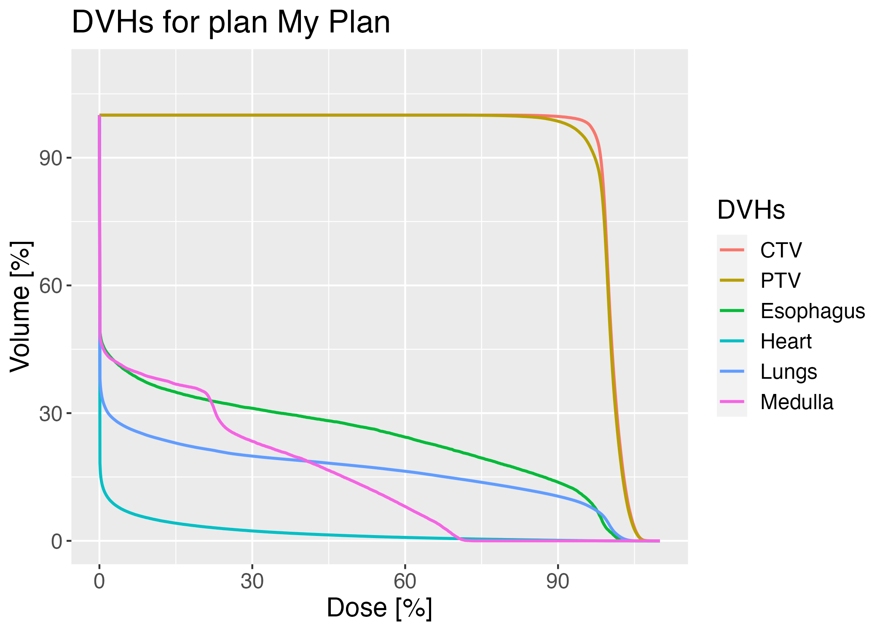
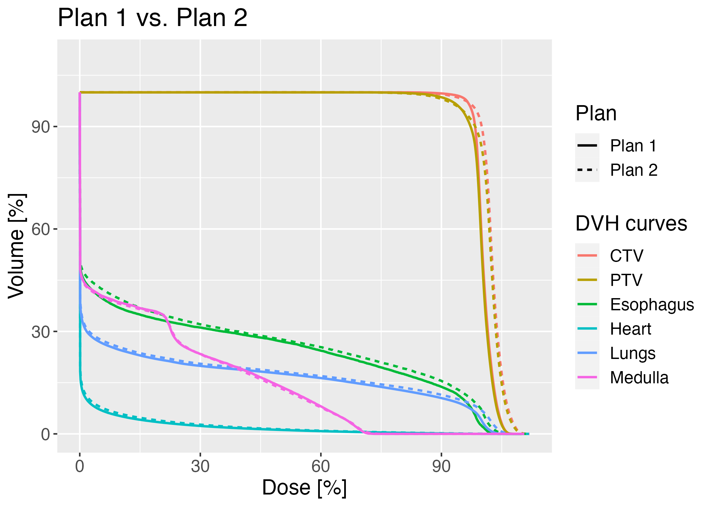
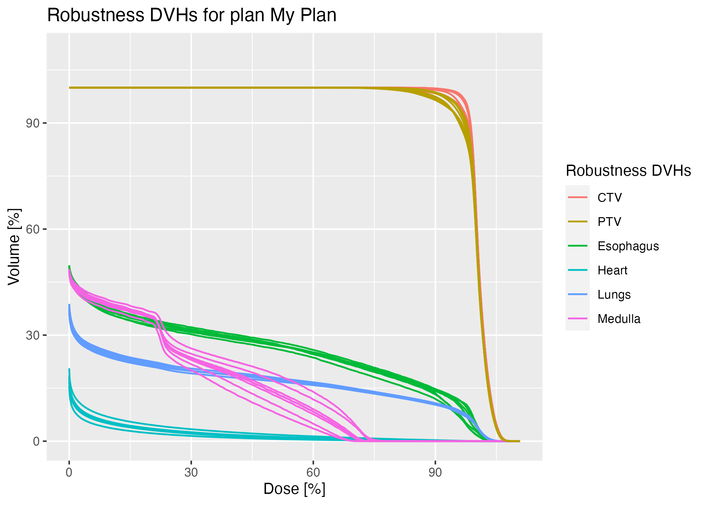

# FIonA-Plans-Analysis

This repository contains functions implemented in R for processing and visualizing data from proton therapy treatment planning created with the in-house treatment planning system **FIonA** developed at the Paul Scherrer Institute (PSI), Switzerland.

## Introduction

The goal of treatment planning is to deliver a certain amount of dose to the target volume and to minimize the dose to healthy tissues while satisfying prescriptions approved by medical doctors, which assign constraints on the maximum and minimum deliverable dose to organs at risk and to the tumor volume, respectively.

Before creating a plan, the patient's tumor and surrounding tissues must be accurately contoured to provide information about the location, size, and shape of the tumor as well as the surrounding healthy tissue. In this step the the **clinical target volume (CTV)** and the **planning target volume (PTV)** are defined:

-   the **CTV** represents the volume of the tumor and surrounding tissues that need to be irradiated to achieve an effective treatment;

-   the **PTV** is an expansion of the CTV that accounts for uncertainties in the treatment delivery process, such as patient setup errors and organ motion, and it aims at guaranteeing that the correct amount of radiation is delivered to the whole CTV.

After that, the plan can be designed using a **treatment planning system (TPS)**. All commercially available TPS for pencil beam scanning (the most widely used proton therapy delivery method) follow the same steps:

-   fields directions are selected and spots are placed by mean of different spot placement algorithms;

-   plan's optimization is performed to place spots in an optimal way to achieve a homogeneous dose distribution within the target volume, the delivered dose is normalized;

-   plans' quality is assessed by checking its robustness and whether all medical prescriptions are satisfied or not;

-   once the plan is ready, it is delivered to the patient.

The functions implemented for the analysis and visualization of plans are specific to the PSI's in-house treatment planning system **Flexible Ion-planning Application**, also known as **FIonA**.


## Repository Contents

This repository contains specific scripts and files necessary to analyze and visualize data output from PSI's FIonA TPS.

-   the `install_packages.R` script contains the packages necessary to run the functions
-   the `functions.R` script contains the documentation for the functions implemented
-   the `tests.R` script contains the test routines necessary to test functions
-   the `test_data` folder contains the data necessary to run tests on functions
-   the `analysis_data` folder contains data to run examples on functions' use
-   the `images` folder contains plots from examples

## Installation

To clone the git repository, type the following commands from terminal:

```         
git clone https://github.com/martibonomi/FIonA-Plans-Analysis
cd FIonA-Plans-Analysis
```

To run the functions used for plans' analysis and visualization, it is necessary to install some required packages. To do that, type the following command from terminal **inside the R environment**:

```         
source("install_packages.R")
```

After that, simply load the functions in the environment by typing:

```         
source("functions.R")
```

and start analyzing data and the plans created.

To test functions and see the overall coverage, type instead:

```         
file_coverage(source_files = "functions.R", test_files = "tests.R")
```

## Functions Usage and Analysis Workflow

The functions implemented and contained in this repository are specific for analyzing outputs from FIonA.

### Plan's DVHs visualization

When creating a plan, dose-volume histograms (DVHs) are created. They are defined as cumulative dose histograms that represent the percentage of the volume of a particular structure (target or OAR) receiving a certain dose level or greater. The dose is typically plotted on the x-axis, and the volume percentage on the y-axis.

DVHs are used to assess the quality of the plan: indeed a good plan should aim at maximizing the area under the curves of target structures (CTV and PTV) and minimizing the area under the DVHs of healthy tissues and organs at risk.

The DVHs generated by FIonA can be visualized by running the following two functions:

-   first upload the .csv file output from FIonA using the `readDVHs` function

```         
my_plan <- readDVHs(dvhs.csv = "path/to/dvhs.csv", rename.structures = TRUE, structures.names = renamed.structures)
```

in which you can decide whether to rename or not the names of structures imported in FIonA by setting `rename.structures = TRUE` and by providing a character vector `renamed.structures` with new names (default values are `rename.structures = FALSE`;

-   then you can plot the DVHs of your plan by using the `plotDVHs` function

```         
plotDVHs(plan = my_plan, plan.name = "My Plan", title = TRUE)
```

in which you can decide whether or not to add a title on your plot. If `title = TRUE`, the function will plot DVHs for plan *plan.name* as title, if `title = FALSE` the function won't plot any title, if instead `title = chr` is set to any string, the function will plot the string you provided as title.



If you prefer to consider only few structures, you can select only the structures to keep from the original uploaded plan with the `selectDVHsStructures` function in the following way:

```         
filtered_plan <- selecteDVHsStructures(plan = my_plan, keep.structures = c("CTV", "PTV"))
```

and visualize only DVHs of the selected structures applying `plotDVHs` to *filtered_plan*.

### Plans' DVHs comparison

If two or more plans are created, it is possible to visualize and compare the DVHs of these plans all together.

To do that, the `plotComparePlansDVHs` function is used:

```         
plotComparePlansDVHs(plans = list("Plan 1" = plan1, "Plan 2" = plan2), title = TRUE)
```

where the function takes as input a list of plans output from the `readDVHs` function. The settings for `title` are the same as the previously explained.



### Plan's robustness assessment

Robustness assessment in proton therapy planning involves evaluating the sensitivity of the treatment plan to geometrical shifts and range uncertainties of the target to ensure that the plan remains effective in delivering the prescribed dose.

To assess the robustness of a plan, FIonA generates 9 different DVHs which correspond to 9 alternative scenarios considered: 6 curves account for geometrical shifts in the ± x, y and z directions, 2 curves account for range uncertainties, while the last curve corresponds to the nominal one.

It is possible to visualize the robustness DVHs of a plan by using the following functions:

-   first, upload the .csv file output from the *Calculate Robustness DVHs* option in FIonA with the `readRobustness` function:

```         
my_robustness <- readRobustness(robustness.csv = "path/to/robustness.csv", rename.structures = TRUE, structures.names = renamed.structures)
```

-   and to plot robustness DVHs, use the `plotRobustness` function:

```         
plotRobustness(my_robustness, robustness.name = "My Plan", title = TRUE)
```

where the settings concerning the renaming of structures and the plot's title are the same as the ones explained for the `readDVHs` and `plotDVHs` functions, respectively.



Also in this case, it is possible to select robustness DVHs for certain structures using the `selectRobustnessStructures` function:

```         
filtered_robustness <- selecteDVHsStructures(plan = my_robustness, keep.structures = c("CTV", "PTV"))
```

and visualize only the robustness DVHs of the selected structures applying `plotRobustness` to *filtered_robustness*.
